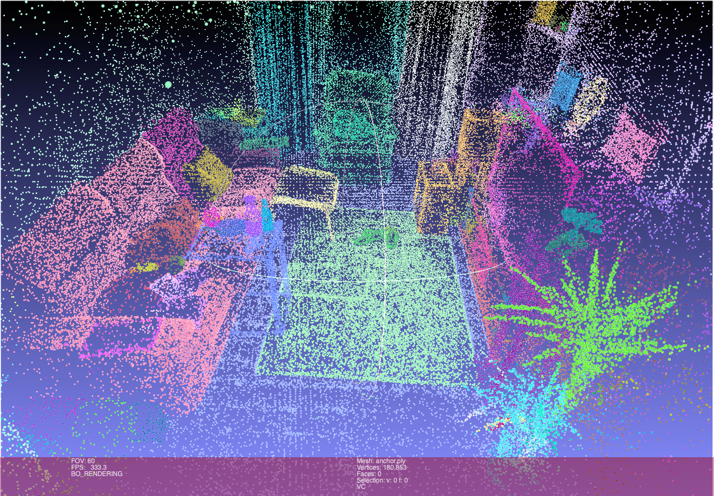

<!--
 * @Author: DyllanElliia
 * @Date: 2025-07-29 20:02:19
 * @LastEditors: DyllanElliia
 * @LastEditTime: 2025-11-26 15:09:53
 * @Description: 
-->

# AGGaussian [ICCV2025]
$AG^2aussian$: Anchor-Graph Structured Gaussian Splatting for Instance-Level 3D Scene Understanding and Editing

<h3>
  <a href="https://arxiv.org/pdf/2508.01740"><strong>Paper</strong></a> | 
  <a href="https://arxiv.org/abs/2508.01740"><strong>Arxiv</strong></a>
  <!-- <a href="https://github.com/DyllanElliia/AGGaussian"><strong>Project Page</strong></a> -->
</h3>

---

[Zhaonan Wang](https://zhaonan.wang/)<sup>1</sup>, [Manyi Li](https://manyili12345.github.io/)<sup>1,†</sup>, [Changhe Tu](https://irc.cs.sdu.edu.cn/~chtu/index.html)<sup>1</sup>

<sup>1</sup>Shandong University

</div>


## Installation

The installation of AG2aussian is similar to [3D Gaussian Splatting](https://github.com/graphdeco-inria/gaussian-splatting). Our default, provided install method is based on Conda package and environment management:
```bash
conda create -n ag2seg python=3.11
conda activate ag2seg

conda install -c conda-forge cuda=12.1.1 gxx_linux-64
pip install torch==2.4.0 torchvision==0.19.0 torchaudio==2.4.0 --index-url https://download.pytorch.org/whl/cu121

pip install -r requirements.txt

pip install submodules/simple-knn/ --no-build-isolation
pip install submodules/diff-gaussian-rasterization-aio-v2/ --no-build-isolation

pip install torch_geometric
pip install pyg_lib torch_scatter torch_sparse torch_cluster torch_spline_conv -f https://data.pyg.org/whl/torch-2.4.0+cu121.html

conda install https://anaconda.org/pytorch3d/pytorch3d/0.7.8/download/linux-64/pytorch3d-0.7.8-py311_cu121_pyt240.tar.bz2
```

(Optional) If you want to process your own dataset, please download [sam](https://github.com/facebookresearch/segment-anything) to `./third_party/sam`. Then install the following dependencies:
```bash
pip install -e ./third_party/sam
pip install git+https://github.com/openai/CLIP.git
```
In default, we use the public ViT-H model for SAM. You can download the pre-trained model from [here](https://dl.fbaipublicfiles.com/segment_anything/sam_vit_h_4b8939.pth) and put it under `./third_party/sam/checkpoints`.

## ToDo List

+ [x] Release code and processed dataset.
+ [x] Export visual point cloud.
+ [ ] Better text query and language feature extractor.
+ [ ] Better instance masks extractor.

## Datasets

We provide converted datasets in our paper, You can use directly train on lerf and mip360_v2 datasets from [here](https://1drv.ms/f/c/0baaa9bf56490a2c/IgAZ59vXjFEHTKIhZG2DrSEzAUwA_m40qEd62-mvVzdpdB8?e=Pk4E33).

The data structure of AG2aussian is shown as follows:
```
./datasets
    /lerf
        /figurines
            /images
            /sparse
            /masks_sparse
            /clip_features
        ...
    /360_v2
        /room
            /images
            /images_2
            /images_4
            /images_8
            /sparse
            /masks_sparse
            /clip_features
        ...
```

## Training

For our converted datasets, you can run the following script for training.
```bash
sh scripts/run_lerf.sh
sh scripts/run_360v2.sh
```
After training, you can view the visualized anchors and segmentation features in `./outputs/<dataset>/<scene>/point_cloud/iteration_35000/anchor.ply`.



If you want to evaluate the text query results.

- First, you need to download the gt mask from [here](https://1drv.ms/f/c/0baaa9bf56490a2c/IgC9tv5HKM-0R5tGN_sEOCBXAYU2XQZgkz4RbOzZ4ZdSs3I?e=hlbLJw) and unzip it to `./datasets`.
- Then, you can run the following command to evaluate the `<scene>`.

```bash
python scripts/compute_lerf_iou.py --scene_name <scene>
```
Our eval code is based on [OpenGaussian](https://github.com/yanmin-wu/OpenGaussian) and [LEGaussian](https://github.com/buaavrcg/LEGaussians), thanks for these impressive open-source projects!


## Processing your own Scenes

### Before getting started

Firstly, put your images and cameras into the `./datasets`. You need to acquire the following dataset format, follow the 3dgs repository.
```
./datasets
    <your_scene>
        /images
        /sparse
```
Then, run the following code to extract the mask and clip features.
```bash
python scripts/extract_datas_masks_v5.py --root ./datasets/<your_scene> --images_folder images --masks_folder masks_sparse --extract_level <coarse,default>
```
where, the `extrac_level` can be set to `coarse` and `default`. If you are more concerned with instance level, it is recommended to use `coarse`. If you have a better mask extractor, you can easily convert it `m=Bool(m,H,W)` to our mask format with `to_sparse(m)`.

### Training

The training only needs to run the following command.
```bash
sh scripts/run_one.sh ./datasets/<your_scene> ./outputs/<your_scene> 3.0 0.5 0.1 <gpu_id>
```
where, the three parameters correspond to `lambda_smooth`, `lambda_contrast`, and `graph_tau`, for contrastive learning of the feature field and anchor graph propagation.
If you want to reconstruct a more fine-grained segmentation field, you can set them to `2.5 0.5 0.05`.

🔥 We also provide a Notebook at `scripts/segment_figurines_graph.ipynb`. It shows how to use click to query instance, and how to localize the instance boundary mask.

## Acknowledgement

Credits to the authors for their excellent contributions in the following works:
- [3D Gaussians](https://repo-sam.inria.fr/fungraph/3d-gaussian-splatting/)
- [LeRF](https://www.lerf.io/)
- [LLFF](https://github.com/Fyusion/LLFF)
- [LEGaussian](https://github.com/buaavrcg/LEGaussians)
- [GsGrouping](https://github.com/lkeab/gaussian-grouping)
- [SAGA](https://github.com/Jumpat/SegAnyGAussians)
- [OpenGaussian](https://github.com/yanmin-wu/OpenGaussian)


## Citation

```
@inproceedings{wang2025ag2aussian,
  title={AG2aussian: Anchor-Graph Structured Gaussian Splatting for Instance-Level 3D Scene Understanding and Editing},
  author={Wang, Zhaonan and Li, Manyi and Tu, Changhe},
  booktitle={Proceedings of the IEEE/CVF International Conference on Computer Vision},
  pages={26806--26816},
  year={2025}
}
```